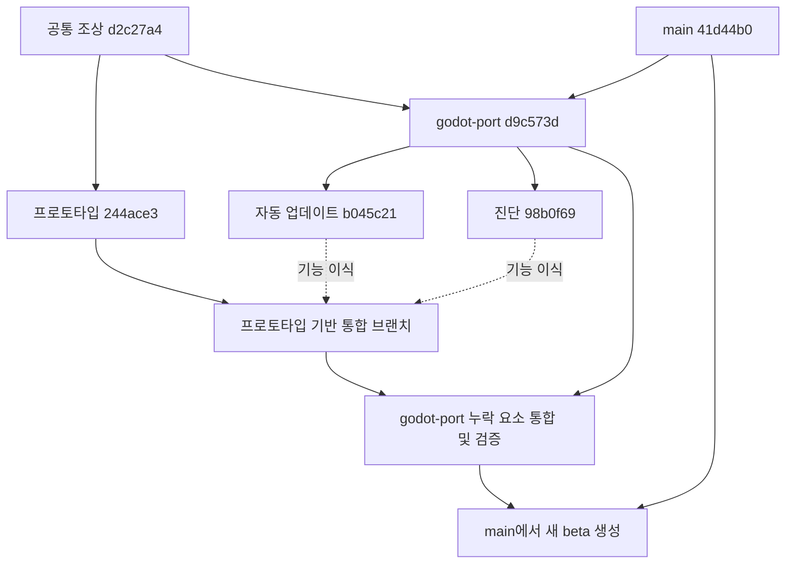

# Godot 브랜치 통합 계획 — 프로토타입 중심

작성일: 2026-10-07. 저장소: `nu4ddi4/security-lab-game`.
원격 브랜치 전체를 fetch한 뒤 커밋 관계·차이·소스와 `git merge-tree` 결과를 확인했다.
이 문서는 병합 실행 전 계획이며, 실제 브랜치 병합·기능 수정·push·릴리즈는 수행하지 않았다.

사용자 제안에 따른 순서는 **프로토타입 기반 작업 브랜치 생성 → 진단·동의 기반 업데이트를 프로토타입에 이식 → 비교한 godot-port의 누락 요소 통합 → 최신 main에서 beta 생성·통합 → beta에서 테스트·안정화 → 안정화된 후보의 main 병합 검토**다.
프로토타입을 기본 진입으로 유지하고, 기존 학습 게임은 `--legacy`로 실행한다.
사용자 동의를 받은 프로토타입 업데이트 설치도 이번 작업의 필수 범위에 포함한다. 기존 상세 맵을 조사 장면으로 교체하는 작업은 별도 범위로 둔다.
`beta`는 테스트와 안정화를 반복하는 브랜치다. 기본 검사 후 통합 후보를 먼저 모으고, 전체 패키지 검증·버그 수정은 beta에서 수행한다. 이번 통합과 beta 생성만으로 main에 병합하지 않는다.

## 1. 확인한 브랜치와 통합 범위

사용자가 말한 `godot`은 원격의 `godot-port`, `proto-type`은 `codex/godot-investigation-prototype`에 해당하는 것으로 해석했다. 해당 이름 그대로의 원격 브랜치는 없다.

| 원격 브랜치 | 확인한 HEAD | 변경과 처리 |
| --- | --- | --- |
| `codex/godot-investigation-prototype` | `244ace3` | 통합의 기준. 사건 엔진·더미 장면·대화·터미널·저장·PC/Android 입력·전용 배포·업데이트 확인. 현재 프로토타입 버전 `0.2.0` |
| `godot-port` | `d9c573d` | 기능 이식 후 누락 요소 통합. 기존 미션 안내·UI 개선, 도시 외관·워크스테이션 배치·레이아웃 검증, 공통 CI |
| `feature/native-auto-update` | `b045c21` | 프로토타입에 기능 이식. Windows 채널별 업데이트, Inno 설치, 저장 후 설치·건강 확인·실패 복구 |
| `feature/native-diagnostics` | `98b0f69` | 프로토타입에 기능 이식. 로컬 진단 복사·지원 ZIP, 로그 요약·저장 검사·종료 표시, 빌드 커밋 기록 |
| `main` | `41d44b0` | 최종 `beta` 생성 기준. 실행 시 최신 원격 HEAD로 갱신 |
| `work` | `4e3b850` | 프로토타입의 조상이며 고유 추가 커밋 0개. 별도 병합 생략. 현재 로컬 `work`는 이 원격 브랜치와 다르게 `41d44b0`을 가리킨다 |

프로토타입과 `godot-port`의 공통 조상은 `d2c27a4`다. 공통 조상 이후 고유 커밋은 프로토타입 26개, `godot-port` 6개다. 두 기능 브랜치는 모두 최신 `godot-port`의 `d9c573d`에서 시작하며 각각 고유 커밋 4개를 갖는다. **진단 브랜치가 업데이트 브랜치를 포함하는 관계는 아니다.**

### 실제 파일 비교 결과와 선택 기준

2026-10-07 원격 HEAD를 다시 확인했고 위 SHA는 동일했다. 아래 판단은 커밋 날짜만이 아니라 해당 파일의 diff와 호출 관계를 비교한 결과다.

| 요소 | 확인 결과 | 통합 기준 |
| --- | --- | --- |
| 게임 규칙·진행·저장 | 프로토타입에 조사 엔진·JSON 사건 콘텐츠·별도 codec·Android 생명주기 저장이 있다 | 프로토타입 유지. Native 학습 미션 엔진으로 교체하지 않는다 |
| 상세 사무실 모델 | godot-port의 GLB 해시가 `799b059e55…`, prototype에 남은 Native 모델은 `c0a5ea759f…`다. 최신 모델에는 키보드 방향·소품 높이·의자 배치 수정이 있다 | godot-port의 모델과 대응 `native-layout.json`을 함께 선택 |
| 도시 외관 | godot-port `exterior.gd`에 결정적 130개 건물 배치·6개 외장 재질 계열·옥상/발코니/도로/강변 표현이 추가됐다 | godot-port 선택 |
| 상세 맵의 물리·시작 위치 | godot-port `world.gd`에 의자 collider 보정과 발 높이 기준 spawn 수정이 있다 | 해당 수정 보존. 조사 장면 연결 시 사건 엔진 의존성을 분리 |
| 기존 학습 게임 UI | godot-port `77ffa94`에 목표·다음 행동·목적·위치 안내, 관찰 카드·재확인 표시가 추가됐다 | legacy UI는 godot-port 선택. 조사 UI에는 표현 중 호환되는 개선만 이식 |
| 조사 대화·터미널·휴대 단말 | prototype의 별도 `prototype/scripts/ui.gd`는 godot-port에 없다. 프로토타입의 대화·메신저 분리·명령 이력/자동완성과 입력 설정이 더 발전했다 | 프로토타입 UI와 업무 흐름 유지. legacy `ui.gd`로 통째로 덮지 않는다 |
| 공통 플레이어·터치 | prototype `ee788b2`가 `touch_axes`, touch/mobile 커서 처리, `look()`과 혼합 입력을 추가했다. godot-port에는 없다 | prototype `player.gd` 유지 |
| 조사 장면과 상세 맵 연결 | prototype은 현재 더미 장면을 직접 만든다. 상세 맵은 Native 장비 anchor 5개지만 조사는 장비 6개·NPC 4명을 요구한다 | 실제 맵 적용 시 논리 ID별 배치·상호작용 adapter와 추가 anchor를 구현한다. 파일 merge만으로 완료 처리하지 않는다 |

상세 맵을 바로 조사 플레이 맵으로 적용할지, 이번에는 자산 통합까지 하고 교체는 후속 작업으로 둘지 사용자 선택을 확인한다. 어느 경우에도 사건 규칙·장비/NPC 논리 ID·원본 열람 조건은 프로토타입 기준이다. Native의 E 조사로 학습 근거를 얻는 규칙을 조사 프로토타입에 복사하지 않는다. 조사의 E는 외관 확인, 원본 확보는 기존 터미널/대화/첨부 규칙을 따른다.



## 2. 통합 시 유지할 기준

- 기본 진입은 `godot/scripts/entry.gd` → 조사 프로토타입. `--legacy`와 `--qa*`는 기존 학습 게임으로 간다.
- 사건 엔진·콘텐츠·원본 열람 권한·보고 승인·Android 중단 시 저장을 프로토타입 기준으로 유지한다.
- 조사 저장 `user://investigation/save.json`과 `save.backup.json`은 기존 `user://progress.json`과 분리한다. 사용자 데이터 루트와 Android 패키지 ID `com.nu4ddi4.securitylab.prototype`, 기존 서명은 유지한다.
- Native의 `0.7.x` 버전·`security-lab-native` 식별자와 프로토타입의 `0.2.x` 버전·`SecurityLab-proto-` 태그를 섞지 않는다.
- Windows는 프로토타입 전용 설치형 업데이트를 추가한다. 자동으로 수행하는 것은 새 버전 확인뿐이며, 다운로드·설치는 사용자 동의 후에 진행한다. 기존 portable EXE 사용자의 설치형 전환은 명시적으로 안내하고, Android는 같은 제품·플랫폼·채널의 APK 다운로드 안내를 유지한다. 두 업데이트 관리자가 중복 실행되지 않게 한다.
- Git 브랜치 `beta`와 앱 업데이트 채널 `beta`는 별개다. 브랜치 이름만으로 앱 채널·게시 권한을 변경하지 않는다.
- 업데이트/진단에서 실제 네트워크나 로컬 파일 접근을 추가할 경우 기존 고정 주소·허용 필드·앱 소유 파일 제한을 이어받는다. 게임 명령은 계속 시뮬레이션이다.

## 3. 단계별 구현·병합과 완료 조건

### 단계 A — 프로토타입 기반 작업 공간 생성

실행 직전 원격 HEAD를 다시 확인한다. 기록한 SHA에서 바뀌었다면 차이와 충돌 분석을 갱신한다. 프로토타입 HEAD를 복구 기준으로 기록하고 별도 worktree에서 작업한다.

```bash
git fetch origin '+refs/heads/*:refs/remotes/origin/*'
git worktree add -b integration/prototype-beta ../security-lab-game-prototype-integration origin/codex/godot-investigation-prototype
cd ../security-lab-game-prototype-integration
git rev-parse HEAD
```

현재 계획 문서는 로컬 `work`에만 추가되므로 실제 작업 시 함께 가져온다. 원본 브랜치의 히스토리는 rebase하거나 force-push하지 않는다.

### 단계 B — 두 기능을 프로토타입에 이식

**기능 브랜치를 통째로 먼저 merge하면 `godot-port` 변경도 따라온다.** 사용자 제안의 기능 우선 순서를 유지하기 위해, 이 단계는 `d9c573d` 이후의 기능 차이를 선별 이식한다. 파일과 의존성을 비교해 코드 이식 또는 필요한 커밋의 cherry-pick을 사용하며, 기존 Native 저장·UI에 대한 참조를 조사 런타임용으로 바꾼다.

| 기능 | godot-port 이후 고유 커밋 | 검토 범위 |
| --- | --- | --- |
| 자동 업데이트 | `d01774d`, `60a8c64`, `9e368ca`, `b045c21` | 정책·관리자·worker·채널 설정·Inno·패키징·검사 |
| 진단 | `85fbd04`, `b2ea92a`, `2ac6f54`, `98b0f69` | 수집·익명화·ZIP·로그·저장·종료 표시·build metadata·검사 |

진단 기반과 자동 업데이트를 각각 구현한 뒤 실제 설치/복구 결과를 진단에서 확인하는 통합 검사를 한다. 소스 파일을 복사한 것만으로 완료하지 않는다. 기존 `LabUpdater`/`LabDiagnostics`는 `game.missions`, `game.saves`, `LabSettings`와 기존 world 구조에 의존하며, 프로토타입은 `state/content/store`와 별도 UI·codec을 사용한다.

**B1. 진단 기능의 완료 조건**

- 휴대 단말 설정 탭에 Windows 진단 복사·지원 ZIP을 연결한다. 공통 익명화·ZIP 로직을 재사용하고 조사 runtime 정보는 별도 adapter가 제공한다.
- 조사 저장 `save.json`과 `save.backup.json`을 `InvestigationSaveCodec`으로 검사한다. 256KiB 한도·손상 원본 보존 정책을 따르고 실제 진행 상태를 변경하지 않는다.
- 조사 상태는 날짜·단계·저장 유효성 등 제한된 값만 출력한다. 증거 원문·답안·열지 않은 원본·행위자 정보는 포함하지 않는다.
- 제한된 로그 요약, 정상/비정상 종료 추정, 정확한 빌드 커밋을 기록한다. 허용 소스 경로에 필요한 prototype 스크립트를 추가한다.
- 진단 실패는 진행 저장·종료를 막지 않는다. 생성된 ZIP에 개인 경로·URL·token·PID·저장 원문·자유 형식 로그가 포함되지 않는다.
- Windows 전용 UI가 Android에서 실행되지 않게 한다. Android 진단까지 확장하는 것은 별도 지원 범위로 둔다.

**B2. 사용자 동의를 받는 채널별 Windows 업데이트의 완료 조건 — 이번 작업의 필수 범위**

- 새 버전 확인 후 **업데이트가 있습니다** 알림에 현재/새 버전과 채널을 표시한다. **다운로드 후 설치**와 **나중에**를 제공하고, 동의 시 다운로드·저장·종료·설치·재실행한다는 점을 알린다.
- 동의 전에는 설치 파일 다운로드나 worker 실행을 시작하지 않는다. 나중에/창 닫기/Esc/일반 게임 종료는 동의로 처리하지 않는다. 종료 시 자동 설치 경로는 제거한다.
- 시작 시 확인 설정과 기존 opt-in은 확인만 허용한다. 동의는 해당 실행의 해당 업데이트에 한정하며 다음 실행/버전에 재사용하지 않는다. 설정에서 같은 확인 창을 다시 열 수 있다.
- 프로토타입 전용 제품 식별자·manifest·설치 경로·버전/채널 규칙을 정의한다. Native의 제품·버전과 혼용하지 않는다. Inno 설치와 채널별 설정을 제공한다.
- 설치 전 `InvestigationStore.save(state, content)`의 성공 여부를 확인한다. 현재 `save_now()`는 bool을 반환하지 않으므로 설치용 호출 계약을 마련한다. 저장 실패·손상 저장·`blocked_save` 상태에서 설치와 종료를 막는다.
- worker가 고정한 `security-lab-native`, 데이터 루트 조건, `progress*.json` 백업과 128KiB 한도를 조사 제품·`investigation/save*.json`·256KiB 정책에 맞춰 확장한다. 기존 경로·해시·동일 제품/채널 검증을 유지한다.
- 새 프로세스의 조사 장면 준비와 codec 복원이 성공한 뒤 건강 확인을 보낸다. 설치/실행/건강 확인 실패 시 설치·조사 저장·백업·필수 입력 설정을 복구한다.
- 설치형 패키지의 내장 metadata와 sidecar를 일치시키고, 크기·SHA-256·소스 커밋을 검증한다. 기존 portable 사용자는 명시적 첫 설치를 통해 설치형 업데이트를 사용하게 한다.
- Android는 APK 다운로드 안내·덮어 설치를 유지하고 Windows Inno/PowerShell 경로로 보내지 않는다. Windows에서도 설치형/portable 방식에 맞는 관리자만 실행한다.
- 성공·rollback·`recovery_required`를 실제 updater stage에서 읽어 진단 ZIP에 제한된 상태 값으로 남긴다.

**B3. 전용 빌드·CI의 완료 조건**

- `scripts/prototype-build.py`의 임시 프로젝트 복사 목록에 공통 서비스·metadata·helper·필요 리소스를 포함한다. 현재는 `prototype/`와 player·폰트 등만 복사하므로 Native 기능 파일이 자동 포함되지 않는다.
- APK도 같은 임시 프로젝트 준비 함수를 사용하므로 Windows 전용 의존성의 분리와 Android 시작을 확인한다.
- 전용 패키지 검사에 진단 UI·ZIP·설치/복구 사례를 추가한다. 채널 manifest 게시 조건은 프로토타입 제품과 최종 `beta` 검증 정책에 맞춰 설계한다.
- 코드 이식 커밋과 제품/저장 adapter 커밋을 구분하고 원본 feature SHA를 기록한다. 기능 이식 후 원본 브랜치를 추가 merge하면 변경이 다시 충돌할 수 있으므로 후속 merge를 자동으로 수행하지 않는다.

### 단계 C — godot-port에서 프로토타입에 없는 요소 통합

```bash
git merge --no-ff --no-commit origin/godot-port
```

각 파일을 비교해 이미 있는 공통 CI와 새로 이식한 기능을 보존하며 충돌을 해결한다. 검사 후 병합 커밋을 만든다.

- 도시 외관·워크스테이션 배치, Native 미션 안내·UI, 레이아웃 검사와 공통 CI의 누락 변경을 반영한다.
- `Interior_07_Godot.glb` LFS 실제 자산과 대응 `native-layout.json`을 함께 가져오고 보호 지오메트리를 검사한다.
- 기본 진입은 조사 장면이며 기존 학습 게임은 `--legacy`로 실행한다. Native용 맵·미션 개선은 해당 경로에서 검증한다.
- 조사 장면을 기존 상세 맵으로 교체하려면 장비/NPC ID와 상호작용을 연결하는 별도 작업이 필요하다. 맵 파일 병합만으로 조사 장면이 바뀌지는 않는다.
- 프로토타입 진단/자동 설치·양쪽 게임·Windows/Android 회귀를 통과한다.

### 단계 D — 최신 main에서 beta 생성 후 통합 후보 병합

기능 구현과 `godot-port` 통합의 기본 검사를 마친 뒤 별도 작업 공간에 `beta`를 만든다. Windows/Android 전체 패키지 검사와 안정화는 beta에서 계속한다. `beta`가 이미 있다면 새로 덮어쓰지 않고 기존 목적과 차이를 확인한다.

```bash
git fetch origin '+refs/heads/*:refs/remotes/origin/*'
git worktree add -b beta ../security-lab-game-beta origin/main
cd ../security-lab-game-beta
git merge --no-ff --no-commit integration/prototype-beta
```

- 기준은 실행 시 최신 `origin/main`이다. 추가 main 변경이 있으면 최종 결과의 충돌·회귀도 확인한다.
- main 기반 `beta`에서 통합 결과의 기본 검사를 확인하고 병합 커밋을 만든다. 원본 prototype/godot-port/main을 별도 수정할 필요는 없다.
- 공유는 통합 후보 `beta`를 push하고, 필요하면 통합 작업 브랜치 → `beta` PR로 검토한다. 각 테스트 빌드와 검증 기록은 대응하는 정확한 beta SHA에 연결한다.
- 프로토타입 패키지 CI·릴리즈 run 선택·채널 게시의 브랜치 제한을 `beta`의 역할에 맞춰 수정한다. 기존 소스/태그/해시/제품 검증은 유지한다.
- 새 기능 배포 버전은 minor `0.3.0`을 권장한다. 배포할 때는 같은 버전의 Windows EXE·EXE 전용 ZIP·APK·체크섬과 추가 Inno 설치 패키지를 검증하고 Pre-release로 게시한다.
- 이번 계획 수정과 향후 beta 병합은 릴리즈나 live 업데이트 채널 게시를 의미하지 않는다. 실제 게시는 별도 배포 요청과 검증을 기준으로 한다.

### 단계 E — beta 테스트·안정화 후 main 반영 준비

- beta에서 Native·조사 엔진·실제 선택한 맵/UI·진단·업데이트 동의/저장/설치/복구를 검사하고 Windows EXE·Inno·Android APK를 검증한다.
- 버그는 beta 또는 beta에서 만든 수정 브랜치에서 고친다. 수정 후 관련 검사를 수행하고, 최종 후보에서 영향을 받은 런타임의 전체 회귀 결과를 확인한다.
- 같은 beta SHA의 Windows 시작·조작·저장·재실행·지원 ZIP·동의 후 설치/실패 복구와 Android 터치/키보드·백그라운드 저장·덮어 설치 결과를 기록한다. 환경 부족은 통과로 간주하지 않는다.
- Windows/Android 패키지 검사, 데이터/제품/채널 분리, 기존 저장 호환성을 완료하고 미해결 진행 차단·저장 손실·동의 없는 설치 문제가 없을 때 안정화 후보로 표시한다.
- 안정화 후보를 대상으로 beta → main PR을 준비한다. main이 전진했다면 최신 main 변경을 beta에 통합하고 영향 받은 검증을 완료한 새 SHA를 사용한다.
- 이번 단계의 목적은 main 반영 준비다. 실제 main 병합은 안정화 완료 후 별도 단계에서 수행하고, main 병합 자체가 릴리즈나 updater 채널 게시를 자동으로 허용하지 않게 한다.

## 4. 확인한 충돌과 해결 원칙

아래는 `git merge-tree --write-tree --name-only`의 **직접 두 브랜치 비교 결과**다. 단계별 해결 후의 충돌 개수는 달라질 수 있다.

프로토타입 ↔ `godot-port`는 7개 파일에서 충돌했다. 프로토타입 ↔ 각 기능 브랜치 직접 비교도 같은 7개에서 충돌했다.

| 파일 | 해결 원칙 |
| --- | --- |
| `.github/workflows/godot-native.yml` | Native EXE/QA와 프로토타입 검사 모두 유지. 진단 Windows 검사와 프로토타입 설치 검사를 추가 |
| `AGENTS.md` | 프로토타입 저장·Android·배포 규칙과 Native의 제한된 updater 예외를 함께 반영 |
| `docs/CI.md` | 두 런타임·프로토타입 전용 패키지·추가 기능의 검사/재사용 기준을 통합 |
| `godot/export_presets.cfg` | entry/prototype 목록 + Native UX/layout 검사 + updater/diagnostics 리소스의 합집합. 전용 prototype preset은 별도로 확인 |
| `scripts/ci-godot-test.py` | 프로토타입의 실제 viewport/stretch 설정과 smoke를 유지하며 updater/diagnostics 의존 파일·검사를 추가 |
| `scripts/ci_scope.py` | prototype 경로와 updater의 installer/Windows fixture 경로를 모두 Godot 범위로 분류 |
| `tests/ci/test_policy.py` | 양쪽 검사 의도를 합치고 통합 경로의 선택/skip/gate를 검증 |

자동 업데이트 ↔ 진단 직접 비교에서는 추가로 아래 5개가 충돌했다.

| 파일 | 해결 원칙 |
| --- | --- |
| `godot/resources/build_info.json` | updater 스키마 필드를 보존하고 진단용 export commit 기록을 결합 |
| `godot/scripts/game.gd` | 초기화 순서, 준비 표시, 저장/종료, updater health와 diagnostics lifecycle를 결합 |
| `godot/scripts/settings.gd` | 업데이트 설정/설치와 진단 복사/ZIP UI를 모두 유지 |
| `godot/export_presets.cfg` | 양쪽 추가 리소스·검사 파일과 helper include 필터를 보존 |
| `scripts/ci-godot-test.py` | updater policy와 diagnostics 검사를 모두 실행; 진단 스크립트의 game/world 의존성도 포함 |

텍스트 충돌 없이 병합되는 `godot/project.godot`, `scripts/godot-build.ps1`도 의미를 검토한다. 프로젝트의 기본 진입·렌더러·로그 설정과 export metadata 원복이 전용 빌드에 미치는 영향을 확인한다.

## 5. CI·패키징에서 놓치기 쉬운 항목

- `.github/workflows/godot-prototype.yml`의 push 대상은 프로토타입 브랜치이고 `pull_request` trigger가 없다. 통합 PR의 일반 CI만으로 Windows/Android 전용 패키지 검증이 완료됐다고 판단하지 않는다. 통합 ref를 선택한 `workflow_dispatch`와 `beta`/PR 경로를 마련한다.
- 현재 `scripts/ci_scope.py`는 main push 또는 draft가 아닌 PR에서만 `windows_godot` 패키지 job을 선택한다. beta의 Godot 변경 push에도 패키지 검증이 실행되도록 beta 조건을 추가하고 선택/gate 검사를 확장한다. 문서만 바뀐 경우 불필요한 전체 빌드는 기존 scope 정책대로 생략한다.
- prototype 패키지 workflow의 paths에 현재 `scripts/prototype-build.py`, `godot/project.godot`, 폰트/라이선스와 신규 공통 서비스 등 일부 빌드 입력이 빠져 있다. 변경 경로·Windows cache key·Android 빌드 입력을 함께 정비한다.
- `scripts/prototype-release.py`는 검증 run의 `head_branch`를 프로토타입으로 제한한다. 최종 배포 기준을 `beta`로 옮길 때 run의 브랜치·SHA·workflow 검증을 함께 갱신한다. 배포는 검증한 beta 소스와 대응하는 run으로 진행한다. 기존 소스/태그 비교·해시 검증을 유지한다.
- `scripts/godot-update-release.py`는 `godot-port` 또는 Native tag만 게시하도록 하고 SHA가 `godot-port`에 포함됐는지도 검사한다. 프로토타입 병합 후 이 gate를 단순 제거하지 않는다. 이번 이식에서 프로토타입의 제품별 게시 조건·manifest·tag와 `beta` 검증 gate를 분리한다.
- Native에 추가한 필터가 전용 prototype export에 자동 적용되는 것은 아니다. metadata와 필요한 공통 진단 파일이 실제 EXE 안에 들어가는지 검사한다.
- 최종 통합 SHA에는 원래 기능 브랜치의 CI 성공을 그대로 전체 검증으로 인정하지 않는다. 변경하지 않은 입력에 대한 빌드 재사용 규칙은 기존 정책을 따른다.

## 6. 검증 계획

Godot **4.7.2 stable**과 기존 캐시를 사용한다. 아래 명령은 통합 작업 공간에서 실행한다. 현재 계획 작성 단계에서는 실행 테스트를 수행하지 않았다.

| 범위 | 검사 | 통과 기준 |
| --- | --- | --- |
| 충돌 해결·문서 | `git diff --check`, `git diff --cached --check` | 충돌 마커·공백 오류 없음, 경로·명령 유효 |
| 공통 Godot 빠른 검사 | `python scripts/ci-godot-test.py --godot <Godot실행파일>` | Native + prototype + updater policy + diagnostics가 빠짐없이 실행 |
| 프로토타입 | `npm run test:prototype -- --godot <Godot실행파일>` | 시나리오·더미 장면·UI 정지·저장·입력 회귀 통과 |
| 기존 Native | `godot --headless --path godot --script res://tests/unit.gd`, `godot --headless --path godot -- --qa` | 미션·저장·장면 QA 통과 |
| 레이아웃/안내 | `godot --headless --path godot -- --qa-layout`, `godot --headless --path godot -- --qa-ux` | 도시/장비 배치, 기존 미션 안내 개선 유지 |
| 보호 자산 | `node scripts/godot-asset-test.mjs` | LFS 실제 자산 준비 후 보호 지오메트리 검사 통과 |
| CI 정책·YAML | `python -m unittest discover -s tests/ci`, `actionlint` | runtime scope, metadata, updater/diagnostics 패키지 정책과 YAML 검증 통과 |
| updater 네트워크 | `python scripts/godot-update-network-test.py --godot <Godot실행파일>` | loopback fixture의 허용/거부·저장 실패·재실행 검증 통과 |
| Windows 설치/복구 | `./tests/native/security_windows_updater.ps1 -Iscc <ISCC실행파일>` | 설치·health 실패·해시/경로 거부·rollback fixture 통과 |
| Windows 진단 | `./scripts/godot-diagnostics-windows-test.ps1 -Godot <Godot실행파일>` | ACL/junction·출력 경로·실패 처리가 fixture에서 통과 |
| Native export | `./scripts/godot-build.ps1 -Godot <Godot실행파일>` 및 `./scripts/godot-diagnostics-export-test.ps1` | EXE 설정 UI·복사·ZIP·내장 commit·저장 보존 확인 |
| 전용 prototype Windows | `python scripts/prototype-build.py --godot <Godot실행파일> --rendered-check` | 독립 EXE의 시작·조작·설정·저장·재실행 및 진단 adapter 확인 |
| 전용 prototype Android | `python scripts/prototype-android-build.py --godot <Godot실행파일>` 및 `python scripts/prototype-android-test.py` | 실제 렌더링, 터치/키보드, 백그라운드 저장, 덮어 설치·재실행 통과 |

기존 fixture는 Native 기준이므로 프로토타입 기능 이식 시 프로토타입 저장·metadata·진단 UI·복구를 검증하는 사례를 추가한다. 특히 다음 통합 사례가 필요하다.

1. `0.2.0` 조사 저장을 새 버전에서 읽고, 신규/기존/손상 저장의 처리와 원본 보존을 확인한다.
2. 초기 진입은 조사 장면, `--legacy`는 기존 학습 게임이며, EXE 전용 prototype 패키지에는 불필요한 기존 맵이 들어가지 않는다.
3. 정상 updater 설치·rollback·`recovery_required`가 진단에 기록되고, 진단 생성 중에도 진행 상태는 변하지 않는다.
4. 동의 전·나중에·창 닫기·일반 종료에서 다운로드/설치가 발생하지 않고, 동의 후에는 저장 실패·미지원 저장·설치 실패·health 실패에서 조사 저장/백업/설정이 보존된다.
5. Windows에서 설정 UI·클립보드·ZIP·저장·재실행을 실제로 확인하고, Android는 입력·pause/resume·덮어 설치로 저장을 확인한다.

검증 결과는 최종 SHA와 함께 **통과 / 실패 / 환경 부족으로 미검증**으로 기록한다. Windows나 Android 검증 환경이 없으면 해당 완료 조건은 미검증 상태로 남긴다. 웹 실행 코드가 바뀌지 않으면 웹 전체 회귀는 생략한다.

## 7. 중단·복구 기준

- 단계별 충돌 해결이나 검사가 실패하면 다음 병합으로 넘어가지 않는다. 진행 중인 merge는 `git merge --abort`로 중단하고 원인을 해결한다.
- 반영 전 실패는 통합 브랜치에서 수정하거나 기록한 prototype HEAD에서 재구성한다. 원본 브랜치를 되돌리지 않는다.
- 반영 후 회귀는 관련 adapter 커밋 또는 해당 merge를 `git revert`로 되돌린다. merge revert는 주 부모를 확인해 `-m 1`을 사용하고, 후속 변경 의존성과 재병합 방식을 함께 검토한다.
- 소스 병합·패키지 검증·프로토타입 릴리즈·Native live manifest 갱신을 각각 구분한다. 최종 배포 기능과 저장 복구 검증이 완료되기 전에는 live updater 채널을 활성화하지 않는다.

통합 후보 구성의 완료 기준은 **프로토타입 진단·Windows 채널별 동의 후 설치/건강 확인/저장 복구 구현 + 비교한 godot-port 누락 요소 통합 + 기본 검사 + 최신 main 기반 beta 병합**이다. beta 안정화의 완료 기준은 **선택한 맵/UI와 양쪽 게임의 회귀, Windows/Android 패키지 검사, 저장 호환성과 설치 복구 검증 완료**다. 실제 main 병합은 안정화 이후 단계다. 상세 맵의 조사 장면 적용 범위는 사용자 선택을 반영한다.

## 8. 업데이트 동의 정책의 선행 수정

`feature/native-auto-update` 기반 로컬 작업 브랜치 `fix/native-update-consent`에서 사용자 동의 흐름을 구현한다. 프로토타입 이식 시 이 변경도 포함한다. 버전 확인 후 `available` 상태에서 대기하며, 확인 창 동의 후에만 다운로드·설치를 시작하고 일반 종료에는 설치하지 않는다. 원격 반영 전에는 작업 브랜치의 미커밋 변경도 함께 가져와야 한다.


## beta 통합 반영 (2026-10-07)

사용자의 병합·베타 릴리즈 요청에 따라 main에서 beta를 만들고 프로토타입, 검증한 godot-port 맵/UI, 업데이트, 진단 브랜치를 차례로 병합했다. 기능 어댑터는 beta에서 조사 엔진과 저장 형식에 맞춰 연결했다. 원본 브랜치와 main은 유지한다.

- 릴리즈: `SecurityLab-beta-0.3.0` 사전 릴리즈. 설치 메타데이터는 `0.3.0-beta.1`이다.
- 사무실 맵의 장비 6개·NPC 4명을 기존 조사 ID로 연결하고 문·충돌·외관을 유지했다. 대화·터미널·메신저와 혼합 입력은 프로토타입을 사용한다.
- Windows 진단은 조사 저장 코덱·256KiB 제한을 사용한다. ZIP에 저장·메모 원문이나 자유 로그 문구를 넣지 않는다.
- 설치형 beta는 별도 AppId·설치 경로·채널을 사용한다. 사용자 동의 뒤에만 다운로드하고, 저장 실패 시 설치를 중단한다. 기존 조사 저장·백업·입력 설정을 복구 대상으로 포함한다.
- 로컬 Godot 4.7.2: Native 452개, update policy 90개, diagnostics 166개, 조사 456개/8개 시나리오 및 서비스 23개 검사 통과. 상세 사무실 smoke의 10개 대상·문·입력·저장 검사 통과. CI 정책 30개, actionlint 및 보호된 자산 검사 통과.
- Windows 렌더링·실제 Inno 설치/복구·HTTP 동의 흐름, Android 설치·터치·키보드·백그라운드 저장·덮어 설치 검증은 동일 beta 소스의 Actions 결과로 릴리즈 전에 확인한다. 실기기 성능·장기 플레이 안정화와 main 병합은 후속 단계다.
